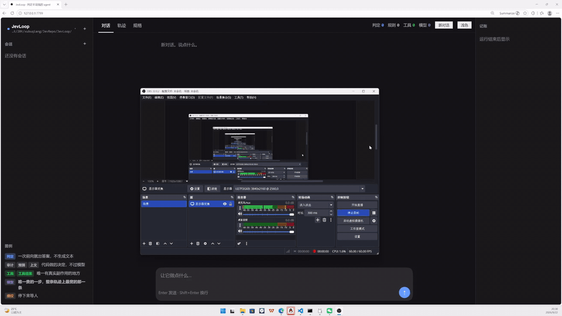

# JevLoop

**Every fork in your agent loop is a full LLM call. Not one of them is generation.**

*Should I act? Which tool? Which file? Is this safe? Did it work? Am I done? Can I ship this?* A conventional agent answers each of those by writing a sentence and parsing it back. But each is a pick, a score or a yes/no answer: one forward pass over a fixed candidate set, ~10–40 ms, no tokens generated.

JevLoop routes them to a decision model ([Jev](https://typesafe.ai) / [Laya](https://github.com/NandaKishorM/laya)) and keeps the LLM for the one thing only it can do: **writing**.

It is a **runnable harness**, not a demo: the loop, the backend seams, the accounting and a web UI — all of it in one command, with no dependency, no build step and no API key.

JevLoop is an independent project. It is not affiliated with, or endorsed by, TypeSafe AI — the name is a reference to the model it routes to, nothing more.

**English** · [中文](README.zh-CN.md)



```
$ npm run demo          # fresh clone: no key, no network, no npm install

JevLoop · demo
  decision  : laya→rule-judge
  generator : scripted — set DEEPSEEK_API_KEY for a real LLM

  ── loop trace ──────────────────────────────────────────
  ▲ laya: TRANSPORT, retrying in 258ms
  ▲ laya unavailable (laya is unreachable: fetch failed), falling back to rule-judge
  cleared: list_dir (auto)
  cleared: read_file (auto)

  ── every decision ──────────────────────────────────────
  step 1
   ~ decide  loop.needsTool         use_tool           4.9ms  needs_tool=0.95
   ~ decide  loop.pickTool          call               4.9ms  tool=list_dir
   ~ decide  loop.gradeRisk         auto               4.7ms  risk=0.0 needs_auth=0.05
   ~ decide  loop.stepOk            continue           4.3ms  ok=0.92
   ~ decide  loop.isDone            keep_going         4.0ms  done=0.10
  ...
  step 3
   ~ decide  loop.canDeliver        deliver            4.5ms  deliverable=0.90 unsupported=0.08
     model   generate (scripted)                       600ms

  ── accounting ──────────────────────────────────────────
  decisions  12     53ms (4.4ms each)
  model       1     600.2ms

  decisions : model = 12.0:1   decisions are 8.2% of wall clock
```

> `~` marks a degraded answer — the bundled judge is a rule table, so every decision it gives is flagged as one. Wall-clock shares move a point or two between runs.

Zero dependencies. Zero build step. Runs offline with no API key.

> That run's judge is a rule table, not a model — it shows the **shape** of the loop, not the quality of a decision. Real backends and what they actually cost: [Honest numbers](#honest-numbers).

---

## The problem

Take a task that needs a few tool calls. **Both loops make the same calls — the difference is what sits in the cycle.**

```
Conventional loop — the model is inside it

   ┌─────────────────────────────────────────┐
   │                                         │
   ▼                                         │
[ LLM call ] ── pick a tool ──▶ [ tool ] ────┘
   │
   └──▶ answer


JevLoop — the model is outside it

   ┌─────────────────────────────────────────┐
   │                                         │
   ▼                                         │
[ Jev ] ── decide ──▶ [ tool ] ──────────────┘
   │
   └──▶ [ LLM call ] ── write ──▶ [ Jev ] ── gate ──▶ answer
```

The conventional agent asks the model at every turn of the loop — *should I act? which tool? is this safe? did it work? am I done?* — and pays a full generation for each answer. JevLoop answers those inside the loop and calls the model only to write: **once**, plus at most one revision when the delivery gate rejects the draft.

| Question the loop asks | Conventional agent | JevLoop |
|---|---|---|
| Do I need to act yet? | LLM call | decision |
| Which tool? | LLM call | decision |
| Is this call safe? | LLM call, or nothing at all | decision |
| Did it work? | LLM call | decision |
| Am I done? | `max_iter` counter | decision |
| Can I ship this answer? | **nothing** | decision |

You were paying generation prices for decisions.

## Quick start

Needs **Node ≥ 22.6** — it runs TypeScript directly, with no build step.

```bash
git clone https://github.com/zjunlp/JevLoop && cd JevLoop
```

**Run the whole loop offline** — the offline judge lives with the examples:

```bash
npm run demo
```

**See what the decisions compile to** — no key, no network:

```bash
node --experimental-strip-types src/cli.ts spec
```

**Open the UI** on http://127.0.0.1:7799:

```bash
npm run serve
```

**Put it to work** — this one needs a decision backend:

```bash
node --experimental-strip-types src/cli.ts run "list the files and explain what they do" --cwd ./some-project
```

It resolves its own backend: the hosted Jev API if `TYPESAFE_API_KEY` is set, otherwise a local Laya on `:7789`. With neither, it says which one it wanted and every step escalates — it does not guess.

> **Not on npm yet.** The CLI is written and packaged (`run` / `serve` / `spec`, `bin: jevloop`); publishing is waiting on a registry account recovery. Until it lands, the commands above are the same entry points — `npx jevloop …` is only their shorthand.

**Drive the demo with a real decision model:**

```bash
npm run demo -- --laya     # local Laya sidecar on :7789 (open weights, free)
npm run demo -- --jev      # official Jev API (needs TYPESAFE_API_KEY)
```

## DECISION.md — the decisions, compiled

Every generation of agent framework leaves behind a `.md`. `AGENTS.md` holds conventions, `SKILL.md` holds capabilities — and both are **prose for a model to read**. The model pays tokens for them every turn, it can ignore them, and nothing tells you whether it did.

`DECISION.md` is the first one that gets **compiled**.

> **Not a decision *record*.** A record is written afterwards, to explain what an agent did. `DECISION.md` declares what the loop is *going to* decide, and a program turns it into the questions the decision model is asked.

One file, two consumers:

```
structure blocks  →  questions + policy  →  the decision model   (tens of ms, no tokens)
prose             →  system prompt       →  the LLM              (the one expensive step)
```

So it is subtraction: every block you move into the file is one question the LLM no longer has to be asked. [`headline()`](src/decisiondoc.ts) counts them **from the file itself** — change a `kind` and the sentence changes with it.

**What does *not* compile is the frame.** Each decision also needs a `state` projection — which few fields of the agent's state go to the model, and how far each is clipped. That is a function, and markdown cannot express one. It stays in [`src/decisions.ts`](src/decisions.ts):

```ts
export const needsTool = defineDecision({
  id: 'loop.needsTool',
  state: ctx => ({ task: clip(ctx.task, 400), earlier: …, steps_done: … }),  // code
  ...compiled('needs_tool', ['needs_tool']),                                  // the file
})
```

Squeezing a frame into markdown would mean either inventing a real DSL or letting the frame degenerate into "send the whole context" — which does not fit the 512/1024-token window the decision model works in. The boundary is deliberate, not unfinished.

The two halves stay honest in opposite directions. Questions and actions come from the file and the code is checked against them **at load**: name a question something the code does not expect and startup fails with both lists, rather than an `undefined` three steps into a run. The frame has no such check, because the file has nothing to check it against — which is exactly why it stays in code.

The file cannot quietly rot, either. It is parsed on load and any problem — an action name that is not in the closed vocabulary, a predicate aimed at the wrong question type — throws with a line number, instead of compiling into a rule that never fires.

```markdown
## grade_risk
kind: mixed
when: before every tool call that actually runs

### risk
ask: How risky is this tool call?
- read-only
- reversible write
- irreversible
- destructive

### needs_auth
ask: This call must be explicitly authorised by a human before it runs
- true — it can destroy data, spend money, or leave the machine
- false — it only reads or writes inside the working directory

policy:
  - score:risk >= 2 → ask_human
  - prob:needs_auth >= 0.5 → ask_human
  - score:risk >= 1 → auto_audit
  - else → auto
```

**The question type is inferred from how the options are written, never declared.** Two options named `true` and `false` is a `noul`; every option named is a `choice`; none named is a `score`; a mix is an error rather than a guess. `kind` then has to agree with what the writing implies.

**Predicates are a closed vocabulary.** `else`, `top >= n` / `top < n` (single-question blocks only), `prob:<id>` (on a `noul`), `score:<id> >= n` (on a `score`), `picked:<id> = <option>` (on a `choice`). There is deliberately no `>` and no `<=`: a condition you cannot write here is a condition that belongs in code.

**A predicate aimed at the wrong kind of question is rejected, not compiled.** Left alone it would become a rule that never fires — the author believes they wrote a gate, there is no gate, and it fails open. Actions are a closed list too, and an unknown one is reported with its line number. Nothing is ever silently dropped: everything unrecognised lands in `problems`, with the line it came from.

### Overriding the thresholds

The numbers in those predicates (`>= 2`, `>= 0.5`) are **defaults**, measured against a pinned Jev version. They are a starting point, not a law — so they can be overridden without editing the file:

```sh
jevloop run "..." --gate can_deliver.unsupported=0.7
JEVLOOP_GATES='can_deliver.unsupported=0.7,grade_risk.risk=4' jevloop serve
```

A key is `<block>.<question>` — the names as they appear in `DECISION.md`.

**A name that resolves to nothing is fatal, on purpose.** `--gate can_deliver.unsupport=0.7` (one letter short) stops with the list of keys that do exist, and a server started with a bad `JEVLOOP_GATES` does not come up at all. The alternative — accepting it quietly — means you believe you tightened a gate and you did not, with nothing anywhere to tell you.

**Where a question has several tiers, the bare name changes the first one** and later tiers need an index, because applying one value to both would make the second unreachable:

```sh
--gate grade_risk.risk=4        # score:risk >= 4 → ask_human   (the second tier stays at 1)
--gate grade_risk.risk[1]=1.5   # score:risk >= 1.5 → auto_audit
```

That unreachability is checked, not trusted: tiers on one question must stay **strictly decreasing**, since the policy is evaluated in order and the first match wins. `--gate grade_risk.risk=0.5` is refused — it would put the "ask a human" bar below the "audit" bar and silently delete a rung.

**The override is recorded, and it never lies about itself.** The effective number — not the file's — goes into the rule's `reason`, which is what the journal stores and what the delivery gate quotes back to the model. `run:start` carries the override map, so a stored run says which thresholds it ran on; the server banner and the CLI accounting print it; the spec page shows the effective predicates. Two runs of the same task that disagree are otherwise indistinguishable in the log, and the first thing you would blame is the model.

## How it works

```
 step ─┬─ loop.needsTool   ↗ do I need to act?  ──no──▶ generate
       │
       ├─ loop.pickTool    ↗ which tool?  (options rebuilt every step)
       │
       ├─ loop.pickInput   ↗ which file?  (only when the tool takes one)
       │
       ├─ loop.gradeRisk   ↗ how dangerous is this?  ──▶ ask a human
       │
       ├─ [ tool runs ]     ← the only place with real side effects
       │
       ├─ loop.stepOk      ↗ did it work?
       │
       └─ loop.isDone      ↗ am I done?  ──no──▶ next step
                            │
                            ▼
                       [ LLM generates ]   ← the only expensive call
                            │
                       loop.canDeliver  ↗ is this shippable?  ──revise──▶ one more generate
```

**All seven decision points live in one file: [`src/decisions.ts`](src/decisions.ts).** If you read one file in this repo, read that one — it's the whole idea.

### A decision is three things

```ts
export const pickTool = defineDecision({
  id: 'loop.pickTool',

  // ① Project the agent state into a BOUNDED decision frame.
  //    This caps what the model can judge: what isn't in the
  //    frame cannot be decided.
  state: (ctx: AgentCtx) => ({
    task: clip(ctx.task, 400),
    already_done: describeDone(ctx),
    files_known: (ctx.files ?? []).slice(0, 20),
    already_read: (ctx.readFiles ?? []).slice(0, 10),
    last_result: clip(ctx.lastResult ?? '', 300),
  }),

  // ② Typed questions. The wording comes from DECISION.md; the
  //    candidates cannot, because a Markdown file cannot hold a
  //    function — `dynamic: toolsFor(ctx)` is how the file says so.
  questions: (ctx: AgentCtx) => ({
    tool: choice(askOf('pick_tool', ['tool']), toolsFor(ctx)),
  }),

  // ③ Policy: answers → action. Also from DECISION.md, and pure code
  //    once compiled. No model involved.
  ...policyOf('pick_tool'),
});
```

Three primitives, taken straight from the Jev wire protocol:

| Primitive | Answer | Used for |
|---|---|---|
| `noul` | P(true), 0–1 | **gate** — allow / block |
| `choice` | one option + per-option probability | **route** — which path |
| `score` | expected level on an ordered scale | **grade** — how bad |

### Two things worth stealing

**Rebuild the options every step.** A fixed action list makes the model pick something that no longer applies — `write_file` should not still be a candidate after you've written the file. That's why `questions` can be a function of the context.

**Never let a probability bypass authorisation.** Risk gating is a hard rule, not a threshold:

```ts
policy: [
  // irreversible ⇒ explicit authorisation. No confidence score overrides this.
  { when: scoreGte("risk", 2), action: "ask_human" },
  // the model's own read is a SECOND, independent gate
  { when: probGte("needs_auth", 0.5), action: "ask_human" },
  { action: "auto" },
]
```

A decision model may decide *whether to ask a human*. It must never decide *whether to skip authorisation*.

## Honest numbers

The same loop against three decision backends. The ratio that matters is decisions : model calls, and the one that surprised us is how much of the wall clock the decisions take.

| Decision backend | Per decision | decisions : model | decision share of wall clock | Quality |
|---|---:|---:|---:|---|
| `examples/rule-judge.ts` (offline demo) | 4 ms | 12 : 1 | **~8 %** | a rule table, not a model |
| Laya `typed-decisions`, local A100 | 30–85 ms | 8 : 1 | ~38 % | **not enough zero-shot** (below) |
| Jev `jev-latest`, hosted API | ~390 ms | 13 : 1 | **79 %** | decisive and correct on every decision |

Two conclusions we are not going to soften:

- **The whole claim holds on a locally-served decision model.** 30 ms decisions make the loop's thinking essentially free next to one generation call.
- **Over the hosted API it does not.** ~390 ms per decision is network round-trips, and with 13 decisions for 1 generation the decisions dominate the clock. Still ~5–8× faster than a frontier LLM call and orders of magnitude cheaper, but "decisions are free" would be a lie at that latency.

The obvious sweet spot is a strong decision model served locally. Neither of the two we could test is that: one is fast but not accurate enough, the other is accurate but round-trips.

### Two gotchas we hit so you don't have to

Both were found by running this loop against a real Laya checkpoint on an A100, not by reading docs.

**`confidence` is not the top probability.** Laya's `confidence` for a choice is normalised Shannon entropy (`1 - H(p)/log(k)`) — `p = [0.80, 0.20]` gives `confidence = 0.269`. So a fixed threshold means a completely different thing at 2 options than at 20. Gate a `choice` on the winning option's probability instead; that's what `topGte()` is for. (The [official docs](https://docs.typesafe.ai/confidence) call `confidence` a solid default and hand you the full `probabilities` for exactly this reason.)

**A base checkpoint will not do a novel decision task zero-shot.** Asked *"which tool next?"*, `laya-typed-decisions` chose `done` at **0.660** on step 2 while the right answer on step 1 scored **0.646** — the wrong answer scored higher, and everything landed in a 0.55–0.66 band with no separation. No threshold fixes that; it's a capability gap. The open-weight checkpoint is a **fast base to specialise**, not a drop-in judge.

Both are the same lesson from [Jev Engineering](https://madewithjev.com/what-is-jev-engineering): *the call is the easy part — the work is in the state you send and the threshold you act on.*

## Bring your own backends

**Decision backend** — anything that answers `{state, questions} → {answers}`:

```ts
import { Decider, HttpProvider, FallbackProvider, MockProvider } from 'jevloop';

const decider = new Decider({
  provider: new FallbackProvider([
    new HttpProvider({ baseUrl: "https://api.typesafe.ai", apiKey: process.env.TYPESAFE_API_KEY, name: "jev" }),
    new HttpProvider({ baseUrl: "http://127.0.0.1:7789", name: "laya" }),
    new MockProvider(),   // never fails
  ]),
});
```

**Generation backend** — anything that turns a prompt into text:

```ts
import { HttpGenerator } from 'jevloop';
// any OpenAI-compatible /chat/completions endpoint
new HttpGenerator({ baseUrl: "https://api.openai.com/v1", apiKey, model: "gpt-5" });
new HttpGenerator({ baseUrl: "http://localhost:11434/v1", model: "qwen3" });  // ollama
```

Swapping either one touches exactly one file. The loop and the decision specs don't move.

To depend on it rather than run it: `npm install jevloop` — once it is published. Until then, `npm install github:zjunlp/JevLoop` builds `dist/` through the `prepare` script.

## The UI

`npm run serve` opens a three-pane app on **http://127.0.0.1:7799**. The picture at the top of this page is one run of it.

| Pane | Shows |
|---|---|
| Left | workspaces and past sessions, read from `~/.jevloop/sessions/` |
| Middle | the conversation, the full decision trace, and the compiled `DECISION.md` spec |
| Right | the accounting — decisions against model calls, what each cost, and the two context budgets with the line they fold at |

The trace is the part worth watching: every decision the loop made, what code did with the answer, and how long it took.

```bash
npm run serve                                  # default cwd: a temporary demo directory
CWD_ROOT=./some-project PORT=7800 npm run serve
```

It has no authentication and binds to loopback only. `HOST=0.0.0.0` means *anyone on this network can make it run tasks on this machine*.

> Once the package is on npm, `npx jevloop serve --cwd … --port … --host …` takes the same three as flags.

## What this is not

- **Not a replacement for an LLM.** Drafting, coding and summarising still need one.
- **Not "zero hallucination".** A decision model can't return an answer outside the type you asked for, but the answer can still be wrong. That's what the threshold is for.
- **Not benchmarked against a conventional agent on the same task yet.** The `12:1` above is from the bundled demo. That comparison is the obvious next step and it isn't done.
- **Not production-hardened.** Tool sandboxing covers path escape only. Read [`src/tools.ts`](src/tools.ts) before pointing it at anything you care about.

## Layout

Six files carry the idea. Read them in this order:

| File | What it is |
|---|---|
| [`DECISION.md`](DECISION.md) | the judgements, as a document the runtime compiles |
| [`src/decisions.ts`](src/decisions.ts) | ★ all seven of them, one file — the whole idea |
| [`src/agent.ts`](src/agent.ts) | ★ the loop that asks them |
| [`src/decide.ts`](src/decide.ts) | the six steps one decision takes |
| [`src/policy.ts`](src/policy.ts) | answers → action, pure code |
| [`src/meter.ts`](src/meter.ts) | ★ decisions against model calls |

Everything else is plumbing. The parts you are most likely to want to replace:

| To change | Go to |
|---|---|
| where judgements get answered | [`src/seam-provider.ts`](src/seam-provider.ts) defines the interface; `provider-http` / `provider-mock` / `provider-fallback` implement it |
| what writes the answer | [`src/llm.ts`](src/llm.ts) |
| what the tools can do | [`src/tools.ts`](src/tools.ts) |
| the UI | [`web/`](web/) and [`src/server.ts`](src/server.ts) |
| the CLI | [`src/cli.ts`](src/cli.ts) |

[`examples/demo.ts`](examples/demo.ts) runs offline on the rule judge in [`examples/rule-judge.ts`](examples/rule-judge.ts). For the full tree, `ls src/` — this section is an index, not an inventory, because an inventory of forty-four files goes stale in a day.

## Contributing

Read [`CONTRIBUTING.md`](CONTRIBUTING.md) first. It says what we merge, what we close without discussion, and where the open work actually is.

## License

Apache-2.0
